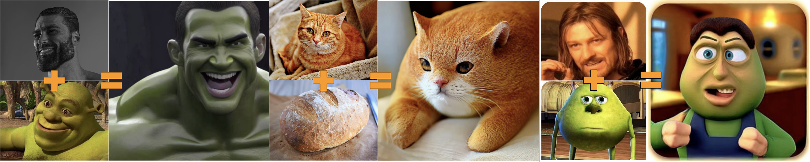

# Stable Diffusion Remix



This script attempts to reproduce the Midjourney Remix.

## Usage

By default, the script produces remixed samples in the current directory. Note that this method requires the upstream version of the diffusers library.

```bash
python run.py /path/to/content_image.png /path/to/style_image.png
```

## How it works

Here is a brief description of the final method. For research details, please refer to the `research` directory.

1. The [Stable Diffusion v2-1-unclip](https://huggingface.co/stabilityai/stable-diffusion-2-1-unclip) model is used as it allows guiding reverse diffusion with CLIP image embeddings instead of text embeddings.
2. The content image is forward-diffused to the specified `timestamp` to use as an initial latent vector.
3. Both the content and style images are encoded with the CLIP model, and their embeddings are averaged with the `alpha` parameter.
4. The reverse diffusion process is run with the initial latent vector of the content image and the averaged CLIP embeddings as guidance.

The most important hyperparameters are:
- `alpha`: determines how much the style image affects the diffusion process.
- `timestamp`: determines how far the content image is diffused to use as an initial latent vector.
- `num_inference_steps`: determines how many steps of the reverse diffusion process are run. 
