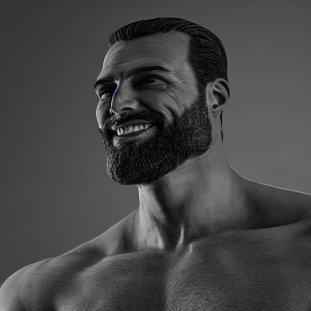

# Stable Diffusion Remix research

__This document is in early draft form.__

This directory contains research and experiments related to the Stable Diffusion Remix.

## Something to read

 - [Midjourney Remix docs](https://docs.midjourney.com/docs/remix)
 - [Great discussion on Midjourney Remix reproduction](https://github.com/AUTOMATIC1111/stable-diffusion-webui/discussions/4595)
 - [InST paper](https://arxiv.org/abs/2211.13203)

## Early experiments

### InST

 - [Code](https://github.com/zyxElsa/InST)
 - [Paper](https://arxiv.org/abs/2211.13203)

This method does pretty much what we want but it requires training converter from image embedding space to text embedding space. For now I tried to stick to no-training approaches.

### CLIP Interrogator

This idea came right from github discussion mentioned above. Straight forward solution is to use vanilla Stable Diffusion. For example, we can somehow get textual representation of content and style images and use them as prompts. This is what [CLIP Interrogator](https://huggingface.co/spaces/fffiloni/CLIP-Interrogator-2) does. It's a great tool but it's not reliable and adds up time and memory requirements.

 - Gigachad prompt: "a man with a beard and a beard is smiling and looking at the camera, octane trending on cgsociety, chris evans as a bodybuilder, monochrome 3 d model, 40 years old women
"
 - Shrek prompt: "a close up of a cartoonish looking green trolly trolly trolly trolly trolly troll troll, elon musk as jabba the hutt, full og shrek, 3d cg, 240p
"

## Image embedding interpolation

TODO

